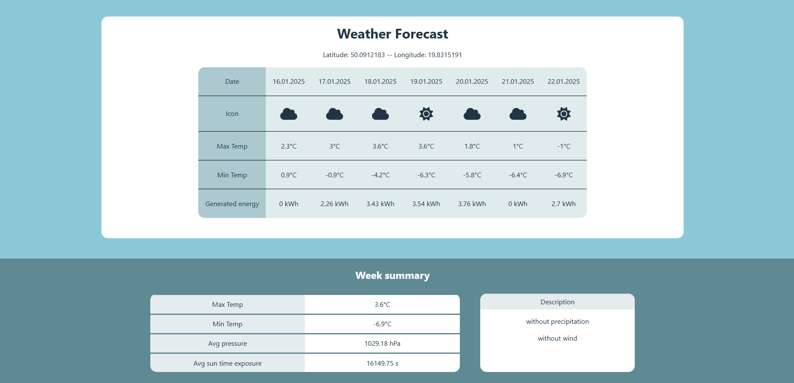

## Weather App

## Demo: [link](https://weatherapp-frontend-z3dk.onrender.com/)

## Description
This project provides a web application that integrates with the Open-Meteo API
to display a 7-day weather forecast and estimate the energy production of a solar installation.  
The application retrieves weather data for a given location specified by latitude and longitude.

Using this data, it calculates:
- Daily solar energy production based on a photovoltaic system.
- A weekly weather summary, including average pressure, average sunlight exposure,
  extreme temperatures and short description (e.g. "without precipitation").

## Technologies
 &nbsp;
 &nbsp;

 &nbsp;
 &nbsp;
 &nbsp;
 &nbsp;